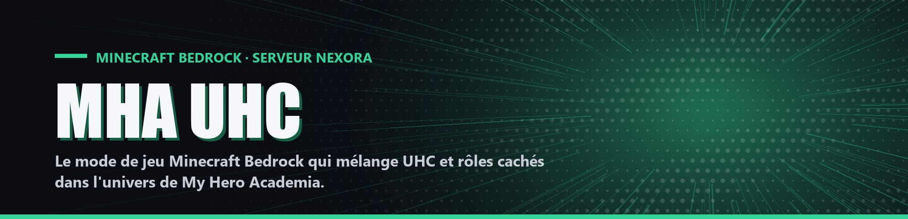

# MHA UHC

<a href="roles/README.md" class="button primary">🎭 Voir les 31 rôles</a> <a href="regles.md" class="button secondary">📜 Lire les règles</a> <a href="commandes.md" class="button secondary">⌨️ Commandes</a>

MHA UHC est un mode de jeu Minecraft Bedrock qui mélange l'Ultra Hardcore (UHC) et un jeu de rôles cachés dans l'univers de My Hero Academia. Chaque joueur reçoit en secret un personnage avec ses pouvoirs, appartient à un camp, et doit faire gagner ce camp en éliminant les autres.

| Élément | Valeur |
| --- | --- |
| Nom | MHA UHC |
| Slogan du pack | « My Hero Academia en ultra hardcore minecraft !! » |
| Plateforme | Minecraft Bedrock Edition, version 1.21.80 minimum |
| Type | Behavior pack scripté (add-on serveur), aucun mod côté joueur |
| Serveur | NEXORA |
| Langue du jeu | Français |
| Nombre de rôles | 31 |
| Camps | Héros (17 rôles), Vilains (8), Préceptes (4), Solitaire (2), plus un duo secret |
| Taille de la carte | 900 × 900 blocs |

## Par où commencer

<table data-view="cards"><thead><tr><th></th><th></th><th data-hidden data-card-cover data-type="files"></th><th data-hidden data-card-target data-type="content-ref"></th></tr></thead><tbody><tr><td><strong>📜 Déroulement d'une partie</strong></td><td>Du lobby à la victoire : lancement, chronologie, mort et conditions de victoire.</td><td><a href=".gitbook/assets/cards/section-regles.jpg">section-regles.jpg</a></td><td><a href="regles.md">regles.md</a></td></tr><tr><td><strong>🛡️ Camps et équipes</strong></td><td>Les quatre camps, le duo secret et les changements de camp en cours de partie.</td><td><a href=".gitbook/assets/cards/section-camps.jpg">section-camps.jpg</a></td><td><a href="camps.md">camps.md</a></td></tr><tr><td><strong>🎭 Rôles</strong></td><td>Les 31 rôles du mode, classés par camp.</td><td><a href=".gitbook/assets/cards/section-roles.jpg">section-roles.jpg</a></td><td><a href="roles/README.md">README.md</a></td></tr><tr><td><strong>⚙️ Mécaniques communes</strong></td><td>Les systèmes communs à tous les joueurs.</td><td><a href=".gitbook/assets/cards/section-mecaniques.jpg">section-mecaniques.jpg</a></td><td><a href="mecaniques/README.md">README.md</a></td></tr><tr><td><strong>⌨️ Commandes et interfaces</strong></td><td>Toutes les commandes du chat et les interfaces en jeu.</td><td><a href=".gitbook/assets/cards/section-commandes.jpg">section-commandes.jpg</a></td><td><a href="commandes.md">commandes.md</a></td></tr><tr><td><strong>🖥️ Héberger une partie</strong></td><td>Configurer et lancer une partie quand on est hôte.</td><td><a href=".gitbook/assets/cards/section-heberger.jpg">section-heberger.jpg</a></td><td><a href="heberger.md">heberger.md</a></td></tr></tbody></table>

## Les camps

<table data-view="cards"><thead><tr><th></th><th></th><th data-hidden data-card-cover data-type="files"></th><th data-hidden data-card-target data-type="content-ref"></th></tr></thead><tbody><tr><td><strong>🟢 Héros</strong></td><td>Les rôles du camp Héros.</td><td><a href=".gitbook/assets/cards/camp-heros.jpg">camp-heros.jpg</a></td><td><a href="roles/heros/README.md">README.md</a></td></tr><tr><td><strong>🔴 Vilains</strong></td><td>Les rôles du camp Vilains.</td><td><a href=".gitbook/assets/cards/camp-vilains.jpg">camp-vilains.jpg</a></td><td><a href="roles/vilains/README.md">README.md</a></td></tr><tr><td><strong>🟣 Préceptes</strong></td><td>Les rôles du camp Préceptes.</td><td><a href=".gitbook/assets/cards/camp-preceptes.jpg">camp-preceptes.jpg</a></td><td><a href="roles/preceptes/README.md">README.md</a></td></tr><tr><td><strong>🟠 Solitaires</strong></td><td>Les rôles du camp Solitaire.</td><td><a href=".gitbook/assets/cards/camp-solitaires.jpg">camp-solitaires.jpg</a></td><td><a href="roles/solitaires/README.md">README.md</a></td></tr></tbody></table>
