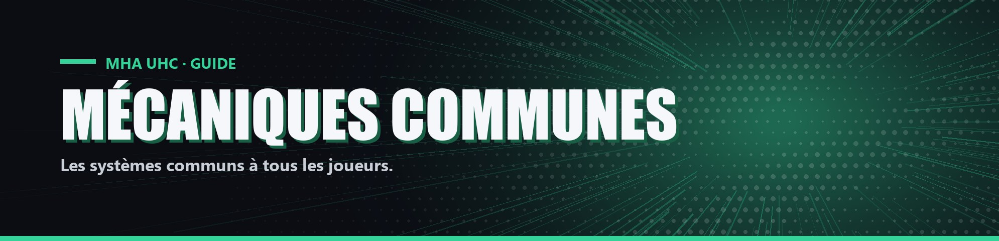

# Mécaniques communes

Ces systèmes s'appliquent à tous les joueurs, quel que soit leur rôle.

<table data-view="cards"><thead><tr><th></th><th></th><th data-hidden data-card-cover data-type="files"></th><th data-hidden data-card-target data-type="content-ref"></th></tr></thead><tbody><tr><td><strong>Objets de pouvoir</strong></td><td>Comment utiliser un pouvoir actif : étoile du Nether, clic droit et temps de recharge.</td><td><a href="../.gitbook/assets/cards/mecanique-objets-de-pouvoir.jpg">mecanique-objets-de-pouvoir.jpg</a></td><td><a href="objets-de-pouvoir.md">objets-de-pouvoir.md</a></td></tr><tr><td><strong>Effets en pourcentage</strong></td><td>Force, Résistance, Vitesse, Régénération et cœurs permanents, avec leurs plafonds.</td><td><a href="../.gitbook/assets/cards/mecanique-effets-en-pourcentage.jpg">mecanique-effets-en-pourcentage.jpg</a></td><td><a href="effets-en-pourcentage.md">effets-en-pourcentage.md</a></td></tr><tr><td><strong>Combat</strong></td><td>Calcul des dégâts, recul, kills et assistances.</td><td><a href="../.gitbook/assets/cards/mecanique-combat.jpg">mecanique-combat.jpg</a></td><td><a href="combat.md">combat.md</a></td></tr><tr><td><strong>Pommes dorées</strong></td><td>Absorption, pénalité en cas d'abus et pommes laissées à la mort.</td><td><a href="../.gitbook/assets/cards/mecanique-pommes-dorees.jpg">mecanique-pommes-dorees.jpg</a></td><td><a href="pommes-dorees.md">pommes-dorees.md</a></td></tr><tr><td><strong>Alters éparpillés</strong></td><td>Cinq pouvoirs bonus à extraire sur la carte pendant la partie.</td><td><a href="../.gitbook/assets/cards/mecanique-alters-eparpilles.jpg">mecanique-alters-eparpilles.jpg</a></td><td><a href="alters-eparpilles.md">alters-eparpilles.md</a></td></tr><tr><td><strong>Yuei</strong></td><td>Le lycée qui apparaît temporairement et cache des bonus d'information.</td><td><a href="../.gitbook/assets/cards/mecanique-yuei.jpg">mecanique-yuei.jpg</a></td><td><a href="yuei.md">yuei.md</a></td></tr><tr><td><strong>QG des Préceptes</strong></td><td>Le labyrinthe où se joue le sort d'Eri quand un Précepte la tue.</td><td><a href="../.gitbook/assets/cards/mecanique-qg-des-preceptes.jpg">mecanique-qg-des-preceptes.jpg</a></td><td><a href="qg-des-preceptes.md">qg-des-preceptes.md</a></td></tr><tr><td><strong>Marqueurs personnels</strong></td><td>Poser des marqueurs visibles par soi seul au-dessus des autres joueurs.</td><td><a href="../.gitbook/assets/cards/mecanique-marqueurs-personnels.jpg">mecanique-marqueurs-personnels.jpg</a></td><td><a href="marqueurs-personnels.md">marqueurs-personnels.md</a></td></tr><tr><td><strong>Lobby et carte</strong></td><td>L'île du lobby et la forêt sombre générée pour les parties.</td><td><a href="../.gitbook/assets/cards/mecanique-lobby-et-carte.jpg">mecanique-lobby-et-carte.jpg</a></td><td><a href="lobby-et-carte.md">lobby-et-carte.md</a></td></tr></tbody></table>
