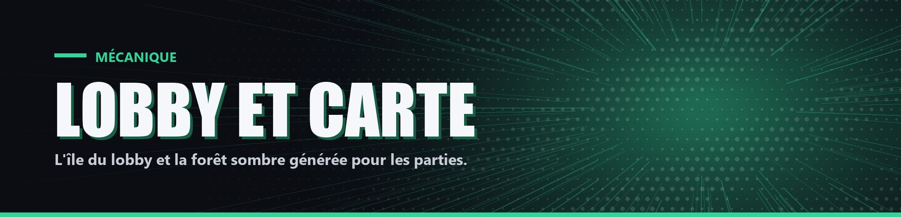

# Lobby et carte

- Lobby : une île flottante construite par le staff, avec une arène pour la cérémonie du podium. Les joueurs y arrivent hors partie et y sont invulnérables.
- Carte personnalisée : une grande forêt sombre de 1000 × 1000 blocs (de -500 à 500), sur une plaine vallonnée, avec clairières, lacs, mares d'eau et de lave et champignons géants. Elle est générée par l'hôte avant la partie ; le sous-sol d'origine (grottes, minerais) est conservé sous la couche 48.
