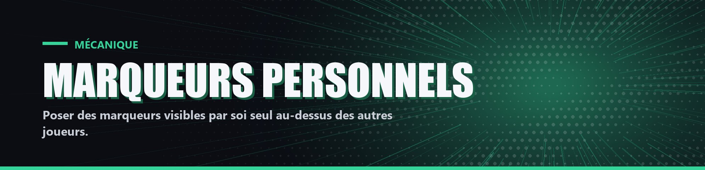

# Marqueurs personnels

Avec `!marqueur` (ou `!mark`), chaque joueur peut poser un marqueur au-dessus de la tête des autres joueurs en vie, pour noter ses soupçons. Le joueur marqué est aussi entouré d'un contour de la même couleur.

- Six marqueurs : cœur vert, cœur bleu, cœur rose, triangle jaune, triangle orange, triangle rouge.
- Seul le joueur qui a posé un marqueur le voit.
- Les marqueurs sont effacés au début de chaque partie.
