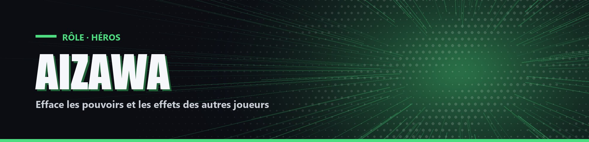

# Aizawa

| Camp | Groupe sanguin | Cœurs de départ |
| --- | --- | --- |
| 🟢 <mark style="color:green;">**Héros**</mark> | 🩸 **B** | ❤️ **10** |

## ✨ Particularités

- Agilité : une barre de 0 à 100 % qui commence à 0. Chaque coup porté à un joueur la remplit de 3 à 4 %, et elle descend de 1 % par seconde.
- Vitesse permanente qui grandit avec l'agilité : 20 % à 0 d'agilité, 60 % à 100.
- Au-dessus de 70 % d'agilité : Résistance 10 %.

## ⚡ Pouvoir actif

### Effacement

Clic droit pour passer du mode Simple au mode Ultime. Accroupi + clic droit pour utiliser le mode choisi.

- Simple (sans temps de recharge) : Aizawa choisit un joueur vivant. Tant qu'il est à moins de 25 blocs de lui, ce joueur perd ses effets positifs (sauf absorption et régénération) et ne peut plus utiliser ses pouvoirs.
- Ultime (1x/8min) : un œil géant apparaît dans le ciel et crée une zone de 30 blocs autour d'Aizawa pendant 1 minute. Tous les autres joueurs dans la zone perdent leurs effets positifs, ne peuvent plus utiliser leurs pouvoirs et reçoivent Lenteur et Faiblesse. Toutes les 13 secondes, la zone rejoint Aizawa.
