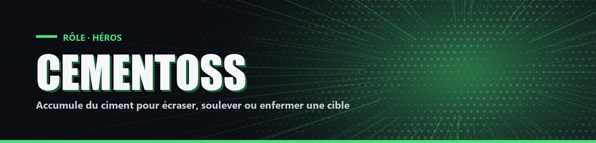

# Cementoss

| Camp | Groupe sanguin | Cœurs de départ |
| --- | --- | --- |
| 🟢 <mark style="color:green;">**Héros**</mark> | 🩸 **O** | ❤️ **14** |

## ✨ Particularités

- Possède un Bloc de Ciment qui ne se consomme pas quand il est posé. Il peut en poser un toutes les 2 minutes.

## 🌀 Pouvoirs passifs

### Poing de béton

S'il n'a frappé personne depuis 5 secondes, son prochain coup inflige +1 cœur.

### Ciment

Tant qu'il reste debout sur un de ses Blocs de Ciment, sa barre de ciment se remplit (environ 30 secondes pour la remplir).

## ⚡ Pouvoir actif

### Ciment

<mark style="color:orange;">**⏱️ 1x/20s**</mark>

Il faut au moins 25 de ciment. Cementoss choisit un joueur vivant à moins de 25 blocs (lui compris), puis une technique. Le ciment utilisé est dépensé.

| Technique | Coût | Effet |
| --- | --- | --- |
| Roche | 25 | Une roche géante écrase la cible : immobilisée, 0,5 cœur par seconde pendant 4 secondes |
| Pilier | 50 | Un pilier de 30 blocs soulève la cible, soignée de 2 cœurs au sommet. Il redescend après 3 secondes |
| Murs | 100 | Quatre murs écrasent la cible : immobilisée, 1 cœur par seconde pendant 4 secondes, puis Lenteur IV et Faiblesse I pendant 4 secondes |
