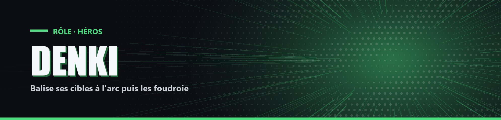

# Denki

| Camp | Groupe sanguin | Cœurs de départ |
| --- | --- | --- |
| 🟢 <mark style="color:green;">**Héros**</mark> | 🩸 **O** | ❤️ **10** |

## ✨ Particularités

- Vitesse 10 %.
- Possède l'Arc Électrique, un arc incassable Infinité / Puissance III.

## 🌀 Pouvoirs passifs

### Batterie

Se recharge de 1 % toutes les 2 secondes quand Électricité est désactivée.

### Balises

Toucher un joueur avec l'Arc Électrique consomme 10 % de batterie et le balise pendant 3 minutes (4 balises maximum par joueur). `!balises` affiche les joueurs balisés.

## ⚡ Pouvoirs actifs

### Électricité

<mark style="color:orange;">**⏱️ sans temps de recharge**</mark>

Active ou désactive Vitesse 60 %. Tant qu'elle est active, la batterie descend de 1 % par seconde. À 0 %, elle se désactive.

### Éclairs

<mark style="color:orange;">**⏱️ 1x/2min**</mark>

Chaque joueur balisé reçoit 1 éclair par balise. Chaque éclair inflige 1 cœur (4 cœurs maximum par joueur) et a 1 chance sur 2 de détruire une balise.
