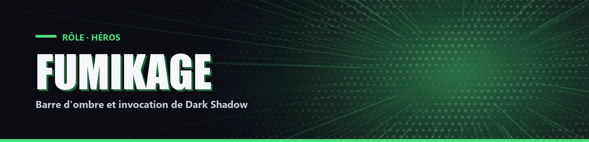

# Fumikage

| Camp | Groupe sanguin | Cœurs de départ |
| --- | --- | --- |
| 🟢 <mark style="color:green;">**Héros**</mark> | 🩸 **AB** | ❤️ **10** |

## 🌀 Pouvoir passif

### Barre d'ombre

+1 par seconde sous les arbres ou la nuit, -1 par seconde le jour à découvert. Fumikage a une Force et une Résistance égales à un dixième de son ombre.

## ⚡ Pouvoirs actifs

### Dark Shadow

<mark style="color:orange;">**⏱️ 1x/4min**</mark>

Invoque Dark Shadow tant qu'il reste de l'ombre (-1 par seconde). Remplace le passif : au-dessus de 5 cœurs, Force égale au quart de l'ombre ; en dessous, Résistance égale au tiers de l'ombre.

### Black Ankh

<mark style="color:orange;">**⏱️ 1x/2min**</mark>

Dark Shadow actif requis. Jusqu'à la fin de Dark Shadow : Résistance égale au tiers de l'ombre et soin de 0,5 cœur toutes les 4 secondes.

### Griffes du Crépuscule

<mark style="color:orange;">**⏱️ 1x/2min**</mark>

Dark Shadow actif requis. Lance un rayon : si un joueur est touché, Dark Shadow prend fin, Fumikage est téléporté sur lui, la cible subit 1 cœur et Fumikage est invulnérable 3 secondes.

## 🌑 Éveil

À son premier kill, Fumikage choisit un pouvoir supplémentaire :

- Black Fallen Angel (1x/5min) : vol libre pendant 20 secondes.
- Ragnarök (1x/5min) : pendant 20 secondes, Faiblesse, mais chaque joueur qui le frappe subit 0,5 cœur et chacun de ses coups a 15 % de chance de le soigner de 0,5 cœur.
