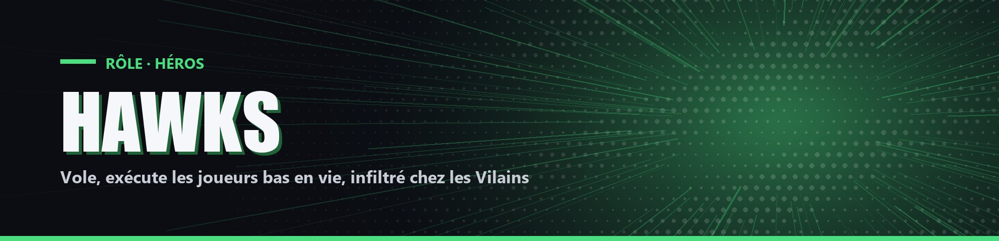

# Hawks

| Camp | Groupe sanguin | Cœurs de départ |
| --- | --- | --- |
| 🟢 <mark style="color:green;">**Héros**</mark> | 🩸 **B** | ❤️ **12** |

## ✨ Particularités

- Vitesse 15 %.
- Apparaît dans la liste des Vilains d'All For One, bien qu'il soit Héros.
- Exécution : si l'un de ses coups doit laisser un joueur à 0,5 cœur ou moins, il le tue.

## ⚡ Pouvoirs actifs

### Adamantine Wings

<mark style="color:blue;">**🔁 activable et désactivable**</mark>

Tant que le pouvoir est actif, Hawks peut voler. Il consomme 2 % de charge par seconde, demande au moins 10 % pour s'activer et se coupe à 0 %. Désactivé, il récupère 1 % toutes les 4 secondes. La charge maximale est de 70 % en début de partie ; chaque kill ou assistance l'augmente de 10 % (100 % au maximum).

### Piqué

<mark style="color:orange;">**⏱️ 1x/30s**</mark>

Si Hawks est à 20 blocs ou plus au-dessus du sol quand Adamantine Wings se désactive, il fonce vers le sol et provoque une explosion. Les joueurs à 15 blocs ou moins perdent 1 cœur (0,5 pour les Héros). Il gagne ensuite Résistance 20 % et Force 10 % pendant 20 secondes. Dans les 5 secondes qui suivent, un clic droit avec son épée le téléporte sur le joueur le plus proche (20 blocs au plus) et le rend invulnérable 2 secondes.
