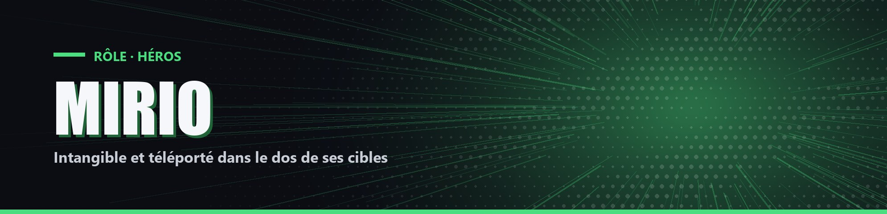

# Mirio

| Camp | Groupe sanguin | Cœurs de départ |
| --- | --- | --- |
| 🟢 <mark style="color:green;">**Héros**</mark> | 🩸 **O** | ❤️ **10** |

## ✨ Particularités

- Résistance 10 %. S'il tue Overhaul, elle passe à 15 %.
- Tous les 30 coups d'épée donnés, il gagne +1 cœur permanent (3 fois maximum).

## ⚡ Pouvoir actif

### Perméabilité

<mark style="color:orange;">**⏱️ 1x/6min**</mark>

Pendant 1 minute, Mirio a Vitesse 40 %. Chaque fois qu'il frappe un joueur, il se téléporte dans son dos. Chaque fois qu'il est frappé, il devient intangible (spectateur) pendant 2 secondes.
