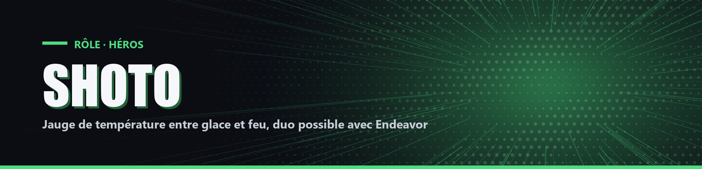

# Shoto

| Camp | Groupe sanguin | Cœurs de départ |
| --- | --- | --- |
| 🟢 <mark style="color:green;">**Héros**</mark> (duo secret possible) | 🩸 **O** | ❤️ **10** |

## ✨ Particularités

- Résistance 10 %.
- Connaît le pseudo d'Endeavor.
- Au bout d'1 minute, il a 20 % de chance de former un duo avec Endeavor (s'il est en jeu). Il doit alors éliminer tous les autres joueurs et débloque `!tempset <0-100>`, qui règle directement sa température.

## 🌀 Pouvoirs passifs

### Température

Commence à 50 %. Monte de 1 % toutes les 5 secondes au soleil le jour, descend de 2 % par seconde dans l'eau. Sous 25 %, Lenteur I. Au-delà de 75 %, il perd sa Résistance.

### Patinoire

<mark style="color:blue;">**⌨️ `!patinoire` pour activer ou désactiver**</mark>

Sous 30 %, les joueurs frappés reçoivent Lenteur II pendant 5 secondes et Shoto gagne Vitesse 50 % pendant 2 secondes.

### Flamme

<mark style="color:blue;">**⌨️ `!flamme` pour activer ou désactiver**</mark>

À partir de 70 %, ses coups enflamment la cible et chaque coup reçu monte sa température de 1 %.

## ⚡ Pouvoirs actifs

### Glace

<mark style="color:orange;">**⏱️ 1x/1min**</mark>

Rayon de glace qui touche tous les joueurs sur son passage. Ils sont étourdis 3 secondes et subissent des dégâts chaque seconde pendant 5 secondes. Plus la température est basse, plus ils sont forts (jusqu'à 0,66 cœur par seconde à 0 %).

### Feu

<mark style="color:orange;">**⏱️ 1x/1min**</mark>

Boule de feu qui touche la première cible. Elle est projetée très loin, brûle 20 secondes sans pouvoir s'éteindre et subit des dégâts. Plus la température est haute, plus ils sont forts (jusqu'à 2 cœurs à 100 %).
