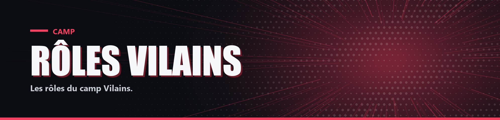

# Rôles Vilains


Tous les Vilains, sauf All For One, connaissent le pseudo d'All For One et celui d'un autre Vilain choisi au hasard.


<table data-view="cards"><thead><tr><th></th><th></th><th data-hidden data-card-cover data-type="files"></th><th data-hidden data-card-target data-type="content-ref"></th></tr></thead><tbody><tr><td><strong>All For One</strong></td><td>Chef des Vilains, vole les alters de ses victimes</td><td><a href="../../.gitbook/assets/cards/vilains-all-for-one.jpg">vilains-all-for-one.jpg</a></td><td><a href="all-for-one.md">all-for-one.md</a></td></tr><tr><td><strong>Black Mist</strong></td><td>Portails, téléportation de groupe et arène du Néant</td><td><a href="../../.gitbook/assets/cards/vilains-black-mist.jpg">vilains-black-mist.jpg</a></td><td><a href="black-mist.md">black-mist.md</a></td></tr><tr><td><strong>Brainless</strong></td><td>Ressuscite tant qu'un allié est en vie</td><td><a href="../../.gitbook/assets/cards/vilains-brainless.jpg">vilains-brainless.jpg</a></td><td><a href="brainless.md">brainless.md</a></td></tr><tr><td><strong>Dabi</strong></td><td>Brûle ses cibles et les piège dans un dôme de magma</td><td><a href="../../.gitbook/assets/cards/vilains-dabi.jpg">vilains-dabi.jpg</a></td><td><a href="dabi.md">dabi.md</a></td></tr><tr><td><strong>Himiko Toga</strong></td><td>Stocke du sang au couteau pour se soigner et se renforcer</td><td><a href="../../.gitbook/assets/cards/vilains-himiko-toga.jpg">vilains-himiko-toga.jpg</a></td><td><a href="himiko-toga.md">himiko-toga.md</a></td></tr><tr><td><strong>Mister Compress</strong></td><td>Enferme ses cibles dans une bulle en hauteur</td><td><a href="../../.gitbook/assets/cards/vilains-mister-compress.jpg">vilains-mister-compress.jpg</a></td><td><a href="mister-compress.md">mister-compress.md</a></td></tr><tr><td><strong>Muscular</strong></td><td>Brute qui inflige des dégâts selon la vie de sa cible</td><td><a href="../../.gitbook/assets/cards/vilains-muscular.jpg">vilains-muscular.jpg</a></td><td><a href="muscular.md">muscular.md</a></td></tr><tr><td><strong>Shigaraki</strong></td><td>Désintègre ses cibles coup après coup puis les exécute</td><td><a href="../../.gitbook/assets/cards/vilains-shigaraki.jpg">vilains-shigaraki.jpg</a></td><td><a href="shigaraki.md">shigaraki.md</a></td></tr></tbody></table>
