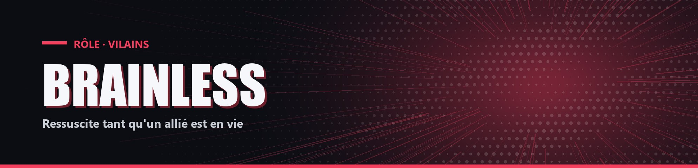

# Brainless

| Camp | Groupe sanguin | Cœurs de départ |
| --- | --- | --- |
| 🔴 <mark style="color:red;">**Vilains**</mark> | 🩸 **O** | ❤️ **12** |


Brainless n'a aucun pouvoir actif. Un joueur peut aussi devenir Brainless en cours de partie via `!brainless`.


## ✨ Particularités

- Résistance 10 %.
- Connaît le pseudo d'All Might.
- La nuit, Force 10 %. S'il tue All Might ou participe à sa mort, sa Force passe à 15 % en permanence.

## 🌀 Pouvoirs passifs

### Régénération

Tant qu'un autre membre de son camp est en vie, il ressuscite à chaque mort. À chaque résurrection, il perd 1 cœur permanent et reçoit Faiblesse I pendant 3 min 30. Il perd sa Résistance dès sa première mort.
- S'il ne reste que des Brainless dans son camp, il ne revient qu'au bout de 3 minutes, et seulement si un autre Brainless est encore en vie à ce moment-là.
- S'il change de camp (manipulé par Overhaul, par exemple), c'est son nouveau camp qui compte pour ses résurrections.

### Lien avec All For One

Voir la fiche d'All For One.
