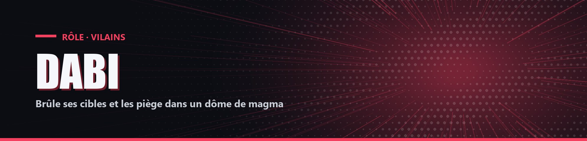

# Dabi

| Camp | Groupe sanguin | Cœurs de départ |
| --- | --- | --- |
| 🔴 <mark style="color:red;">**Vilains**</mark> | 🩸 **O** | ❤️ **10** |

## ✨ Particularités

- Au bout d'1 minute de jeu, il apprend si Shoto et Endeavor forment un duo.

## 🌀 Pouvoir passif

### Flammes bleues

Activable et désactivable avec `!fire`. Les joueurs qu'il touche (épée ou arc) et ceux qui le touchent brûlent pendant 4 secondes sans pouvoir s'éteindre.

## ⚡ Pouvoir actif

### Crémation

<mark style="color:orange;">**⏱️ 1x/4min**</mark>

Marque tous les joueurs ayant subi des dégâts de feu dans les 5 dernières secondes, puis crée un dôme de magma de 30 blocs de rayon dont personne ne peut sortir pendant 30 secondes.

- Chaque joueur marqué dans le dôme reçoit 2 cœurs de dégâts et donne à Dabi +6 % de Force pendant le dôme (3 joueurs marqués = +18 %).
- À la fin du dôme, il perd cette Force mais récupère 3 cœurs.
- Dans la lave à l'intérieur du dôme, il récupère 1 cœur toutes les 0,4 seconde.
