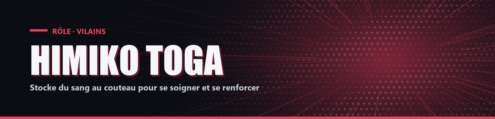

# Himiko Toga

| Camp | Groupe sanguin | Cœurs de départ |
| --- | --- | --- |
| 🔴 <mark style="color:red;">**Vilains**</mark> | 🩸 **O** | ❤️ **10** |

## ✨ Particularités

- Possède Couteau, une épée en diamant incassable Tranchant III.
- Toutes les 3 pommes dorées mangées, elle obtient Régénération III pendant 3 secondes.
- Chaque kill lui donne +1 cœur permanent (3 maximum).

## 🌀 Pouvoirs passifs

### Sang

Chaque coup donné avec Couteau stocke 1 point (20 maximum).

### Transfusion

Clic droit avec Couteau (au moins 3 points) pour consommer tous les points et se soigner. Plus elle a de points, plus le soin est grand (20 points = 3 cœurs).

## ⚡ Pouvoir actif

### Métamorphose

<mark style="color:orange;">**⏱️ 1x/2min**</mark>

Force 10 % pendant 1,5 seconde par point de Sang (20 points = 30 secondes).
