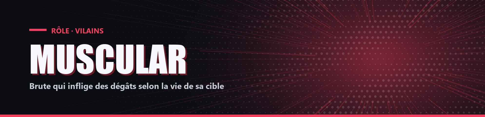

# Muscular

| Camp | Groupe sanguin | Cœurs de départ |
| --- | --- | --- |
| 🔴 <mark style="color:red;">**Vilains**</mark> | 🩸 **A** | ❤️ **13** |

## ✨ Particularités

- Résistance 15 %.
- Connaît le pseudo de Deku. S'il le tue, il gagne +7 % de Force permanente.

## ⚡ Pouvoir actif

### Augmentation Musculaire

<mark style="color:orange;">**⏱️ 1x/5min**</mark>

Pendant 40 secondes, Force 10 % et ses coups infligent des dégâts supplémentaires égaux à 8 % de la santé de la cible (cible à 10 cœurs = +0,8 cœur).
