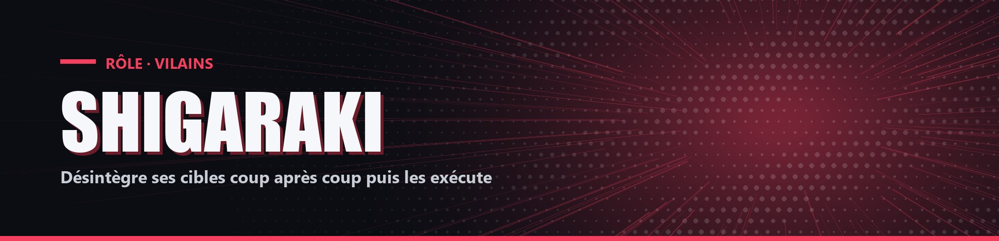

# Shigaraki

| Camp | Groupe sanguin | Cœurs de départ |
| --- | --- | --- |
| 🔴 <mark style="color:red;">**Vilains**</mark> | 🩸 **AB** | ❤️ **10** |

## ✨ Particularités

- Force 20 %.

## 🌀 Pouvoir passif

### Désintégration

Chaque coup monte le stade de désintégration du joueur frappé de 1 à 6 %. À 100 %, contre ce joueur :

- 10 % de chance d'infliger 0,5 cœur supplémentaire en le frappant.
- Exécution : s'il tombe à 0,5 cœur ou moins sous ses coups, il meurt.

## ⚡ Pouvoirs actifs

### Zone de Désintégration

<mark style="color:orange;">**⏱️ 1x/5min**</mark>

Il faut garder l'objet en main 4 secondes avant de l'activer. Crée une zone de 20 blocs de rayon pendant 10 secondes : les ennemis à l'intérieur prennent 0,5 cœur par seconde et Lenteur I. Chacun de ses coups prolonge la zone de 0,3 seconde.

### Insolubilité

<mark style="color:orange;">**⏱️ 1x/50s**</mark>

Pendant 4 secondes, il ne peut pas mourir et survit forcément à 0,5 cœur.
